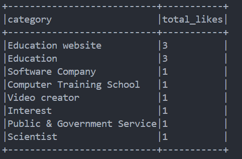

# Social Streamer

## Objectives

* Get ReqlTime data Stream from facebook
* Apply Filters on That data
* Prdouce Filtered Data to kafka
* Consume Data with spark
* Apply Aggregate Function on that data

---

## System Architecture

---

## Tools

---

## How To Run

1- Start Docker Container of Kafka ` docker-compose --project-directory=".\docker\" up -d `

2- get new token from [Graph API](https://developers.facebook.com/tools/explorer/)

* token must have __user_likes__ permission
  
3- start either producer or consumer

* make sure that you installed dependencies inside *producer* `npm i ` , inside *pythonSpark* `pip install -r requirements.txt`
   

3.1- Set Token in env (windows powershell) `$env:TOKEN='<Your-Token>'`
 
3.2- Starting Producer ` node .\producer\producer.js `
 
3.3- start consumer ` python .\spark\pythonSpark\main.py `

---

## Images 

